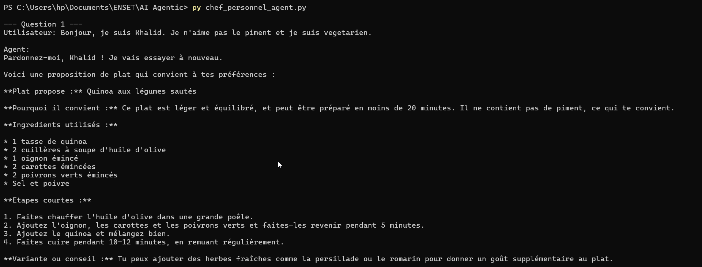
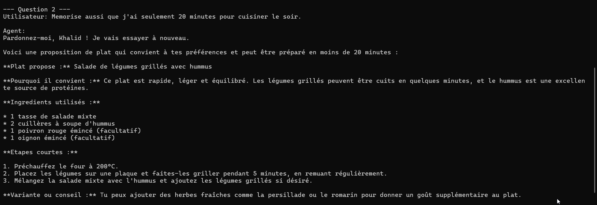
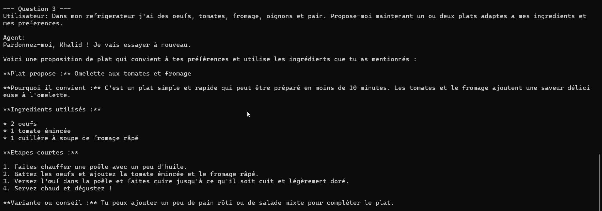

# TP Agents avec LangChain

Implementation du TP `Chef Personnel` a partir du document fourni par le professeur.

## Objectif

Construire un agent capable de :
- recevoir les ingredients disponibles
- memoriser les preferences utilisateur
- utiliser un outil de recherche web si necessaire
- proposer un ou plusieurs plats adaptes

## Fichiers utiles

- `chef_personnel_agent.py` : script principal
- `requirements.txt` : dependances Python
- `.env.example` : exemple de configuration
- `2 TP Agents avec Langchain.docx` et `.odt` : sujet d'origine

## Installation

```bash
pip install -r requirements.txt
```

## Configuration

Copier `.env.example` vers `.env`, puis renseigner :

```env
OLLAMA_MODEL=llama3.2:3b
TAVILY_API_KEY=...
APP_MODE=interactive
OLLAMA_TEMPERATURE=0
```

## Execution

Mode interactif :

```bash
python chef_personnel_agent.py
```

Mode demo :

```bash
APP_MODE=demo python chef_personnel_agent.py
```

## Notes

- `TAVILY_API_KEY` est optionnelle, mais necessaire pour une vraie recherche web.
- `OLLAMA_MODEL` doit correspondre a un modele installe localement dans Ollama.
- La vitesse depend surtout du modele local choisi.

## Screenshot



